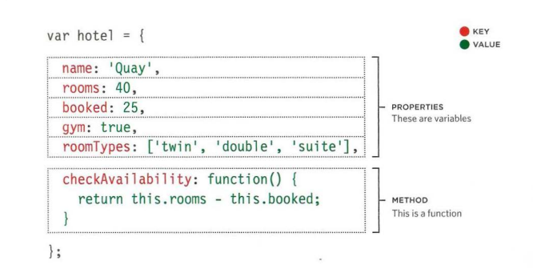

## Understanding The Problem Domain Is The Hardest Part Of Programming.
Because you have a big issue that you might know how to structure the solution for but yet can not wrap it and build it quite correctly as it might seem un clear what you are trying to do and how you are doing it. The key to understanding the problem is to understand how the end user works and how the product fits into how they work. 
Understanding problem domain is both hard and crucial for you to solve it correctly and hpw the client exactly want and in a way that would be easy for the end user to use.

# JAVASCRIPT:
## The object part:
Objects are used to group an entire set of data and fuctions that are called properties and methods inside the object block as they refer to a reliable object in the real world and this is important as the whole world is currently moving towards the (IOT) so it is highly important to know how to code objects from the world around us.

#### syntax of object:
(Type objectName = {property name: value,}

- Data as properties: They are used to further define the object. For example if we are going to create an animal object the properties we'll have must include name, age, breed and so on and together with its value called (Key).
- Functions as methods: As it's called inside the object and as we know it is used to perform a specific task.

------------------

# Document object model(DOM):
The DOM is an interface used by the browser that display and present pagescin using its tree it offers flexibility in manipulating the elements of a web page by using attributes such as text content and inner HTML etc. In the book it teaches you how to access the objects in a page, how to access the objects in a collection, and how to change element styles dynamically.

Also you can implement HTML elements from JS to HTML page using create element and by previously defining a parent element to give it an ID.

Dom consists of four types nodes:

1- Document nodes

2- Element nodes

3- Attribute nodes

4- Text nodes

# And that was it for this summary