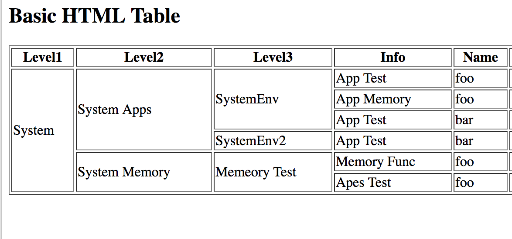

## My summary of the reading 07.
# Domain moddeling:
Domain modeling is used to create a conceptual model for coding problems. And the point of it to give and help the developer get a deeper understanding of the problem and validate their information surrounding the solutions.

1- When modeling a single entity that'll have many instances, build self-contained objects with the same attributes and behaviors.

2-Model its attributes with a constructor function that defines and initializes properties.

3-Model its behaviors with small methods that focus on doing one job well.

4-Create instances using the new keyword followed by a call to a constructor function.

5-Store the newly created object in a variable so you can access its properties and methods from outside.

6-Use the this variable within methods so you can access the object's properties and methods from inside.

## Tables:

Tables are a huge part in the HTML as they allow us to further organize or data in the website such as sports results, it's defined using the table tag and it has its own related tags to organize the table itself.

1-**TR**: It's used to indicate the start of each row in the table.

2-**TD**: Which is used to represent cells inside the table to manipulate them.

3-**TH**: In which is used to represent the heaading of a column or a row in the table.

4-**Colspan**: Used to span and separate columns from one another.

5-**Rowspan**: Used to span and separate rows from one another.

6-**Thead**: Used to separate the head part of the table from the rest to make it easier when coding.

7-**Tbody**: Used to separate body of the table from the other parts.

8-**Rowspan**: Used to separate the foot of the table from the upper parts and this could be useful when defining thing like end result or just additional short informations.

# An example of the table:

# And its syntax:

# And that was it for this summary