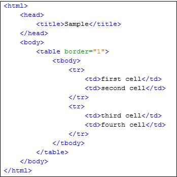

## My summary of the reading 08.
# In this part we will be talking about the layout of the page and how to appropriately organize the "Containers" of my page in order to make it presentable and easier to control.

#### Display of layouts:

1- Normal flow (static positioning): Whitch is the default position in CSS and basically its layout is about having each element on top of the other i'd like to think of as the layout of a normal book page.

2- Relative positioning: Which basically has the elements in boxes with almost the same layout as the "Normal flow" but the difference here is thatwe can control each box on it's own and move them around but it affects the postioninhg of other boxes around it.
   

 3- Absolute positioning: Once you use it the box is completely out of the normal flow and it would be on its own (meaning whatever changes will be made on the element i this positioning will not apply to others in other postionings) also the page scrolls up & down with the movements of the bars.

 4- Fixed postioning: It's a type of the absolute postioning and it does the exact oopsite, meaning it has a value of fixed which basically you scroll up & down but it stays on the same position of the page.

 5- Z-index: Used to control elements when using absolute and fixed positions to control elements so that whenever the user scrolls the page each element stays in its place.

 6- Float: Allows you to put elements on specific parts of the page without affecting the main parts. 

7- Clear float: Decides where each element will appear and how and it has attributes (left, right, both, none).
***Layouts have two types:***

- Fixed layout: It has a fixed width of elements so whether the user zooms in or out it doesnt change its width.

- Liquid layout: It changes its sizes based on users activities.

## Important to note is that there is a alayout type called grid which is cosidered to be the best and most used layout due to it's flexibility.

# An example of web pages layout:

# Different examples of layouts:

# And that was it for this summary
