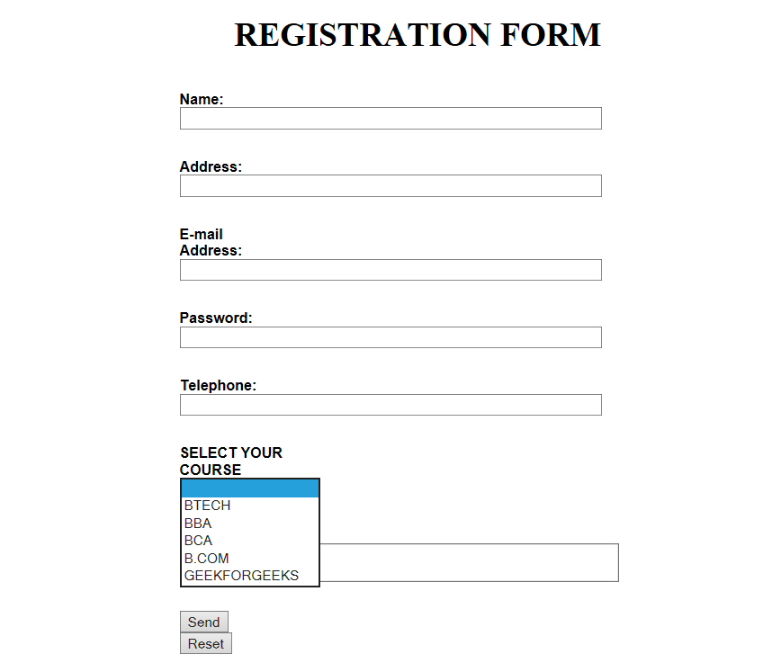
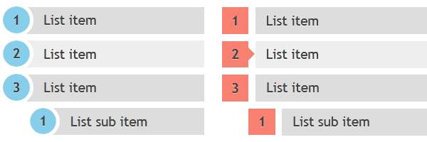
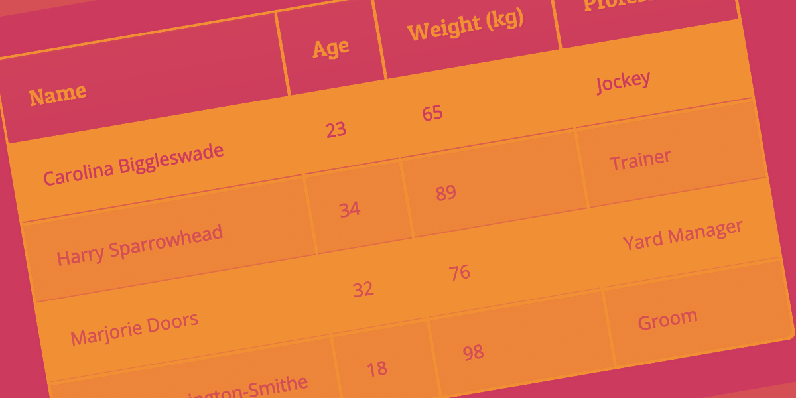
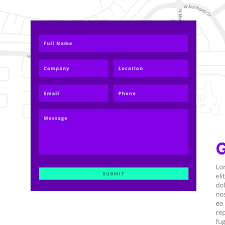

## My summary of the reading 09.
# Forms:
We all know that forms are printed documents used for formal transactions. HTML has borrowed this concept and is using it to collect user input, the user input is most often sent to a server for processing.

This element is a container for different types of input elements, such as: text fields, checkboxes, radio buttons, submit ,etc.

### Form controls:
HTML forms use different ways to collect informations and it's split into 3 types:

1- ***Adding text***:
 
- **Text input**: Used for entering single line input such as emails, user names,etc.

- **Passwword input**: Used for entering single line input as well but in the form of characters.

- **Text area**: Used for entering a longer than single line inputs such as comments..

2- ***Making choices***:

- **Radio buttons**: Used when users must select only one choice out of all choices available.

- **Check boxes**: Used when users are allowed to use  more than one choice of all choices available.

- **Drop-down boxes**: Used when users must select one choice out of a list.

3- ***Submitting forms***:

- **Submit button**: Used to submit data entered by users.

- **Image button**: Used when users are allowed to submit images.

- **File upload button**: Used when users are allowed to upload files to the websites.

## How forms work?

1- Users must fill up the form with the required informations.

2- Each of the form control elements names that i have mentioned previuosly are sent to the server with its value -entered by the user-.

3- The server analysis and process the recieved data using the appropriate programming languages and it may store the data in it's data bases.

4- Then the server creates a new
page and sends it back to the browsers used with the information it has recieved.

# An example of the forms:
.

------------------
# Lists, tables and forms in CSS:

1- **List**: Reading this part about **list's** i have learned that we need list's in our website's for various reasons therefore we need to know how to style them appropriately.

Using CSS List markers can be given different appearances, using the list-style-type and list-style image properties.

# List styling example:

2- **Tables**: Tables are a huge part in the HTML as they allow us to further organize or data in the website such as sports results, it's defined using the table tag and it has its own related tags to organize the table itself.

Using CSS each table cell can have a diffrent spaces and sizing from others.

# Table styling example:

3- **Forms**: As i have previously defined it, it is used to gather and store information from users.

# Form styling example:

------------------
# Events part:
Now aas we all know and have tried events before while browsing the internet, you must have clicked a button or link or hovered over a link and it immediately changed color, all of these reactions to your mouse movements are done by events in programming languages, and in JavaScript in particular it uses (DOM) to do so.

### There are some javascript events:
1- onclick events: This is a mouse event and provokes any logic defined if the user clicks on the element it is bound to.

2- onkeyup event: This event is a keyboard event and executes instructions whenever a key is released after pressing.

3- onmouseover event: This event corresponds to hovering the mouse pointer over the element and its children, to which it is bound to.

4- onmouseout event: Whenever the mouse cursor leaves the element which handles a mouseout event, a function associated with it is executed.

5- onchange event: This event detects the change in value of any element listing to this event.

6- onload event: When an element is loaded completely, this event is evoked.

When events occur in elements it can trigger a function so therefore it feels very interactive.
# And that was it for this summary