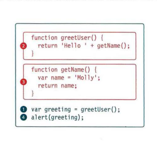
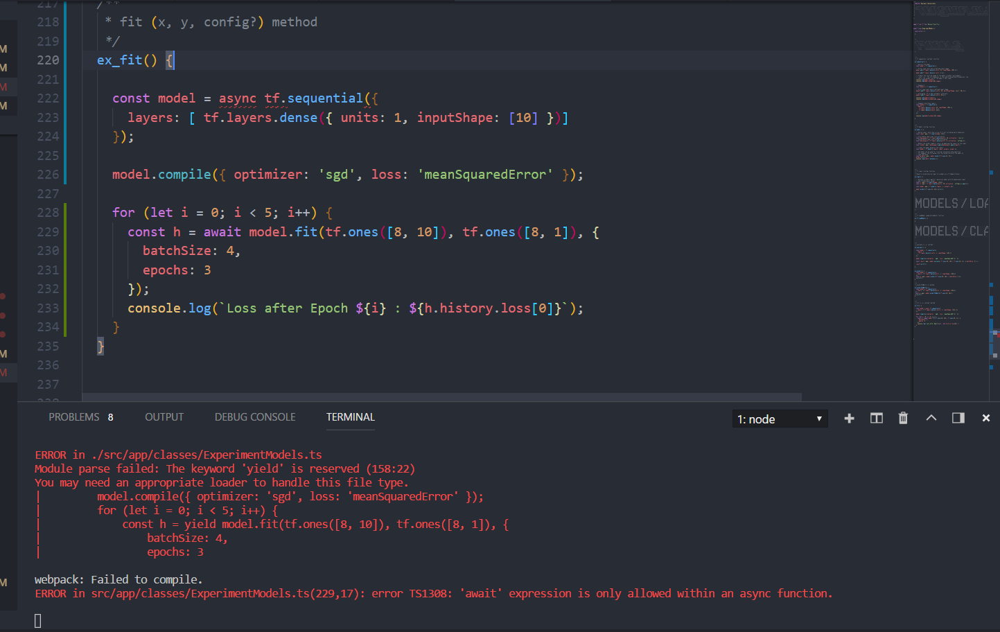

## My summary of the reading 10.
.

# JavaScript debugging:
Coding is not an easy process and writting a good code comes from a lot of time invested in practicing however, no matter how good your coding skills are; you will always make mistakes and sometimes it wouldn't tell you where is it so you just set there stuck not knowing where to start looking for errors, that's called debugging and that's literally why browsers now adays have built in debuggers to help with such issues also tha's why exception handling exist.

As from writing code ypu can tell when a specific part is gonna give you an error so you throw an error handling and/or sometimes exceptions where you would think that some sort of error might occur. Therefore we use it to  avoid crashing your code and avoid error messages from popping up as it can be frustarating.

Order of execution statements in JS:

## What is error handling?
The process where you would inform your user when something goes wrong such as broken internet connection or the user may have entered an invalid value therefore you should let them know.

## What is an error in JavaScript?
Errors in JS are a type of object that is thrown in the code in order to handle a potential error.

### Error types in JavaScript:

1- ***Error***.

2- ***EvalError***.

3- ***InternalError***

4- ***RangeError***

5- ***ReferenceError***.

6- ***SyntaxError***. 

7-***TypeError***. 

8-***URIError***. 

You need to understand execution contexts which are  two types plus understand the:

- Stack: In the error domain stack is basically one problem goes on top pf others as JS checks for error line by line and therefore errors are stacked on top of eachother.

- You can use console to help you finding errors.

- Knowing which error types to expect you can use try & catch statements to handle them to avoid code crash and un necessary errors.

# Debugging Tips:

1- Another browser: as some errors appear in specific browsers as sometimes browsers do not support specific features of the used language.

2- Add numbers: write numbers in console.log to help you know which number didn't execute so you can know where the errors at.

3- Strip oy back: minimize your used code lines by grouping related parts in an function and put all related elements together.

4- Search: use search engines to search for your error.

5- Code playgrounds: use it to copy and paste  your code or add link to the forum and others will help you debugging.

6-Validation tools: there are online validation tools you can use.
It searches your code line by line for errors.

# An example of error handling:
.

# And that was it for this summary