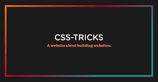

## My summary of the reading 11.
.

# CSS IMAGES:
Images are very important part in the website and there for they must be well organized and defined to make my website more appealing and beautiful, so in CSS it offers us ways to control our image to make match our expectations:

### Controlling the sizing of images:
You can control the size of an imahe using width and height properties and doing so helps the website to load smoothly without crashing and without breaking them as it also tells the browser how much space to leave for the image while loading as CSS & HTML load before images.

### Aligning images using CSS:

1- ***Float***: It represents  the size of an image and determines on which side it will show (Left & right).

2- ***Align***: Images can be aligned both horizontally and vertically using CSS.

### Centering images using CSS:

1- ***Align element***: You can use on the element containing the image.

2- ***Margin***: You can use it on the image itself.

### Reapeating images:
- Repeat: The background image is by default repeated horizontally and vertically.
- Repeat X: Repeats background image horizontally.

- Repeat Y: Repeats background image vertically.

- No repeat: The image is only shown once.
- Fixed: The image remains in the same position while scrolling.
- Scroll: The image is scrolled up and down as the user moves the bars on the sides.

### Background positioning:

1- left top

2- left center

3- left bottom

4- center top

5- center center

5- center bottom

7- right top

8- right center

9- right bottom

### Notes:
- You can use a background image behind the box
created by any element to write on top of it which is called contrast of images.

- You can create something called image sprites; to reduce the number of images the browser has to load.

- You can create image rollover effects by moving the
background position of an image.

### And that was it for this summary of chapter 16.

# Chapter 19:
This chapter talks about how to successfuly launch a professional website:

- Search engines optimizations (Using on-page technique): 
  

   1- Page title: Which is the title that appears at the top of the web browsers tab so make it intersting.

   2- URL/web: Which is the name of the file part so make sure to use special words and names.

   3- Headings: Using good and related title names in headings gives the browser an idea about the topic of your site and gives it a greater weight.

   4- Text: Which is the text within the body so make sure to use a special terms and maximum repeat it 3 times don't over use it as it might compicate the reading for the users.

   5- Link text: Try to link specific parts of your page such as paragraphs to a related title at the top of the page to make it easier for the users when searching for it.

   6- Image alt text: When adding image make sure to give it a proper alt related to it, just in case the picture didn't load for some reason the user will get an idea about what the picture is.

   7- Page describtions: Give your website a short and clear describtion using the meta tag in the head as it helps search engines recognize your site faster and easier.

   ## How to Identify keywords and phrases: 
   which as i previously mentioned it's important for your website as it helps the search engine recognizing your site among others of the same topic.

   1- **Brain storm**: Make a llist of all proper words that you would think are appropriate and users would type in search engines then start narrowing them down by maybe ask your friends or family about the words they would type in relation to your sites main topic.

   2- **Organize**: Group all related words into groups and separate the in categories.

   3- **Research**: You canuse online tools that will help you generating synynoms and words related to the ones you entered.

   4- **Compare**: Try to use tools like google advanced search to check what and how many times a certain word has been used as it's unlikely that your site will appear at the top of the  search engines for every word since there will probably be a good amount of people and sites usong it, this can help you into thinking deeper of how you can top them or at leastget on the top.

   5- **Refine**: By this point your list should contain only the words that you will actually be using and that are relevant to the topics of your site despite the competetion surrounding that specific word you should still use it as it improves your chances of getting more users on your site.

   6- **Map**: Now you should choose your last 3-5 words that you'll be using and make sure to not repeat them on every page and try to focus them on home page.
   
   #### Keep track of your website using Analytics tools such as Google Analytics as it allows you to see how many people visit your site, how they find it,and what they do when they get there.

   ### Notes:
   - You will need a a domain name and a web host in order to launch your website on the web.

   - FTP programs are the third party or the" Post man" of your web page that transforms the informations and data between the web page and the server.

   - You will need to use specific platforms that some other websites provide for you to use those tools to help you save time instead of building them from scratch.

.

## And that was it for this summary.

