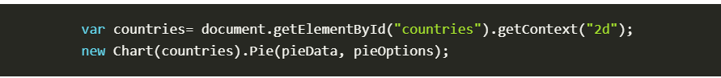
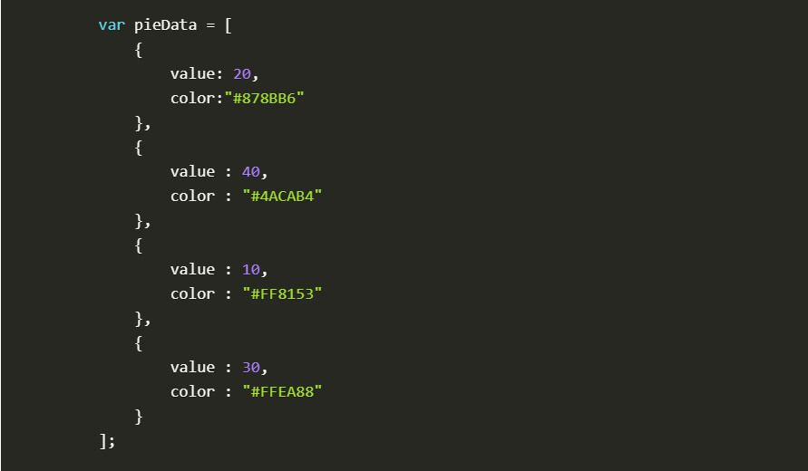

# Charts in JS

Using charts displays data and especially statistics in much easier and understandble way by almost everyone and therefore it is available in HTML5 t make it and write its code on your website to make much more organized.

### Makin charts in JS steps:
1- The first thing we need to do is download Chart.js. Copy the Chart.min.js out of the unzipped folder and into the directory you’ll be working in. Then create a new html page and import the script.

2- To draw a *line* chart use the following pieces of code:
    
    

3- To draw a *pie* chart:
    
    
    
    

4- To draw a *bar* chart:
    
    
    

### Chart.js can be used with ES6 modules, plain JavaScript and module loaders.

## A bit of an explanation on the previous elements un the pictures above:

- Canvas element: It's almost like the imah=ge element except it doesn't take a src nor alt properties it only has two attributes height and width that are actually optional you can also set these attributes using the DOM properties.

- We also use an ID attribute, it's notnecessary but it makes it easier to identify it when coding in JS.

- Drawing shapes: canvas  supports two primitive shapes: rectangles and paths (lists of points connected by lines). All other shapes must be created by combining one or more paths.
1- Drawing a rectangle: 
    - To draw a filled rectangle => fillRect(x, y, width, height)
    - To draw a rectangle outline => strokeRect(x, y, width, height)
    - To make it transparent => clearRect(x, y, width, height)

2- Drawing paths: 
    - To create a new path => beginPath()
    - To start a sub-path => closePath()
    - To stroke the outlines of the shape => stroke()
    - To draw a solid shape => fill()

### Note:The first step to create a path is to call the beginPath(). Internally, paths are stored as a list of sub-paths (lines, arcs, etc) which together form a shape. 

### And in order tom learn more read about it further as this is just a summary.

## Styling charts:
  1- Colors: uses two methods
     - fillStyle = color => to fill the whole shape
     - strokeStyle = color => to color the outlines of the shape

  2- Transparency: we can draw opaque shapes to the canvas and we   can draw translucent shapes
     - globalAlpha = transparencyValue =>  to apply transparency value.

  3- Line styles: used to style lines
    - To set the width of the line => lineWidth = value
    - To set the appearance of lines ends => lineCap = type
    - To set the appearance of the corners => lineJoin = type
    - To control how thick the junction becomes => miterLimit = value
    - To control current line dash pattern array => getLineDash()
    - To set the current line dash pattern => setLineDash(segments)
    - To specify where to start adash array => lineDashOffset = value

  4- Gradients: We create a CanvasGradient object by using one of the following methods
    - createLinearGradient(x1, y1, x2, y2) => to create a linear gradient object with a starting point of (x1, y1) and an end point.
    - createRadialGradient(x1, y1, r1, x2, y2, r2) => Creates a radial gradient where the parameters represent two circles.
    - createConicGradient(angle, x, y) => Creates a conic gradient object with a starting angle.

 5- Drawing text: canvas rendering context provides two methods to render text
   - fillText(text, x, y [, maxWidth]) => Fills a given text at the given (x,y) position.
   - strokeText(text, x, y [, maxWidth]) => Strokes a given text at the given (x,y) position. 

 6- Styling text: There are some more properties which let you adjust the way the text gets displayed on the canvas
  - font = value => used when drawing text.
  - textAlign = value => text alignment setting.
  - textBaseline = value => baseline alignment setting.
  - direction = value => directionality.

  # That was  it for the summary for further and deeper knowledge please make sure to read more about the topics.
