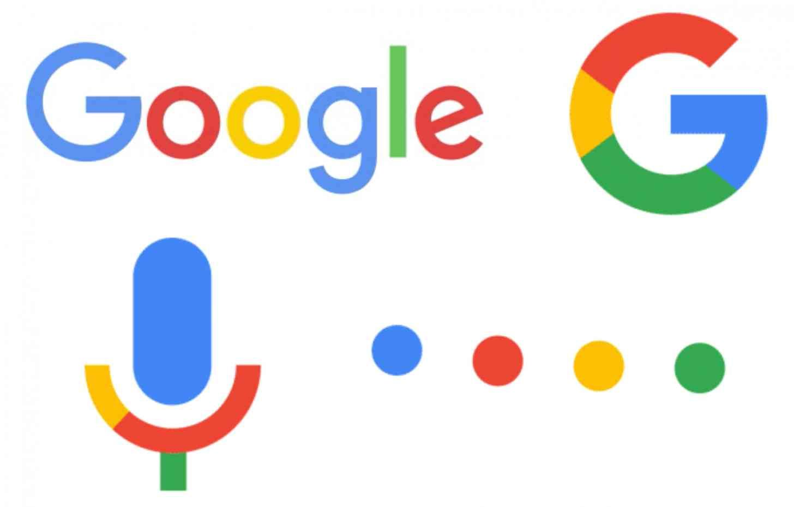

# What Google Learned From Its Quest to Build the Perfect Team

Our data-saturated age Today, on corporate campuses and within university laboratories, psychologists, sociologists and statisticians are devoting themselves to studying everything from team composition to email patterns in order to figure out how to make employees into faster, better and more productive versions of themselves

1- How to Build a Perfect Team

2- The War on Meetings

3-The Case for Blind Hiring

4- Failure to Lunch

5- The 'Good Jobs' Gamble

6- Rethinking the Work-Life Equation

7-The Rise of White-Collar Automation

8-The Post-Cubicle Office

9-The New Dream Jobs

Yet many of today’s most valuable firms have come to realize that analyzing and improving individual workers ­— a practice known as ‘‘employee performance optimization’’ — isn’t enough. As commerce becomes increasingly global and complex, the bulk of modern work is more and more team-based

## Sillicon Valley

In Silicon Valley, software engineers are encouraged to work together, in part because studies show that groups tend to innovate faster, see mistakes more quickly and find better solutions to problems

- Google became focused on building the perfect team

- Google’s People Operations department has scrutinized everything from how frequently particular people eat together to which traits the best managers share.

- The company’s top executives long believed that building the best teams meant combining the best people. They embraced other bits of conventional wisdom as well
study people’s habits and tendencies
how teams worked.

### Were the best teams made up of people with similar interests?did it matter more whether everyone was motivated by the same kinds of rewards?

### How often did teammates socialize outside the office?

### Did they have the same hobbies?

### Were their educational backgrounds similar?

### Was it better for all teammates to be outgoing or for all of them to be shy?

**‘We had lots of data, but there was nothing showing that a mix of specific personality types or skills or backgrounds made any difference. The ‘‘who’’ part of the equation didn’t seem to matter.**

