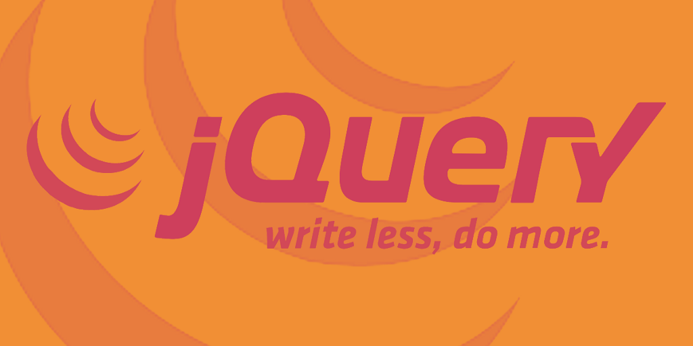

## My summary of reading the First reading about Responisve web designs.

# What is jQuery:

jQuery: JavaScript file that you include in your web pages . offers a simple way to achieve a variety of common JavaScript tasks quickly and consistently, across all major browsers and without any fallback code needed.

1- Select elements
2- Perform tasks
3- Handle events

# Why use JQuery:

* Simple selectors

* Common tasks in less code

* The • htm 1 () and • text () methods both retrieve and update the content of elements.

* Getting and setting attribute values (.attr() , . removeAttr() , . addClass() , .removeClass())
Inserting elements ( .before() , .after() , .prepend() , .append()
* Working with each element in aselection ( .each() , this or $(this))

# Get and Set Data:
Get: when a JQUERY selection hold more than one element, when we get the element it will only retrieve information from the first one. The .html() and .text() methods both retrieve and update the content.

Set Information: when a JQUERY selection hold more than one element, and a method is used to add data it will be added to all elements. The .append () method lets you add content to the page.

# Some function with JQUERY:
Load event: has been replaced with .on(), the on event is fired with the whole page is loaded.

.ready(): checks if the browser supports the DOMContentLoaded event. It doesn't however wait for the assets to finish loading.

### The position of elements can affect how quickly a web page seems to load.

# jQuery Syntax
The jQuery syntax is tailor-made for selecting HTML elements and performing some action on the element(s).

Basic syntax is: $(selector).action()

* A $ sign to define/access jQuery
* A (selector) to "query (or find)" HTML elements
* A jQuery action() to be performed on the element(s)

### EVENTS:

# EVENT METHODS
The • on () method is used to handle all events Using the . on () method is no different than using any other jQuery method; you:

* Use a selector to create a jQuery selection.
* Use . on() to indicate which event you want to respond to. It adds an event listener to each element in the selection.

# THE EVENT OBJECT
Every event handling function receives an event object. It has methods and properties related to the event that occurred. 

# ADDITIONAL PARAMETERS FOR EVENT HANDLERS
The • on () method has two optional properties that let you: Filter the initial jQuery selection to respond to a subset of the elements; Pass extra information into the event handler using object literal notation.

# Ways to include Jquery in your page
Hosting the jquery file with the rest of the website , in addition to that you can use a version that is hosted by another company but you still need to include the fallback version.

 # LOADING JQUERY FROM A CDN:
A protocol relative URL :used When a page loads jQuery from a CDN <script src=" //ajax .googl eapi s . com/ ajax/l i bs/ jquery / 1.10. 2/ jquery .min. js "></ script>

# WHERE TO PLACE YOUR SCRIPTS:
The position of <script> elements can affect how quickly a web page seems to load.
if you place the script at the end of the page before the closing </body> tag, it will not affect the rendering of the rest of the page.

# NOTE: START OF PAIR PROGRAMMING SUMMARY

# Pair Programming
6 reasons for pair programming

1- Greater efficiency: It is easier to catch mistakes in the making+ may come to a solutions faster.

2- Engaged collaboration: Knowing when to ask for help.

3- Learning from fellow students: If one programmer is more experienced in a certain skill, they can teach a student who is less familiar with that area.

4- Social skills: Communication is key.

5- Job interview readiness: The ability to work with and learn from others and stellar communication skills are as (or more!) important to a company than specific technical skills.

6- Work environment readiness: Graduates who are already familiar with how pairing works can hit the ground running at a new job, with one less hurdle to overcome.

# How does pair programming work?
pair programming commonly involves two roles:

1- The Driver is the programmer who is typing and the only one whose hands are on the keyboard
(manages the text editor, switching files, version control, and—of course writing—code)

2- The Navigator uses their words to guide the Driver but does not provide any direct input to the computer

# Why pair program?
there are four fundamental skills that help anyone learn a new language:

1- Listening: hearing and interpreting the vocabulary

2- Speaking: using the correct words to communicate an idea

3- Reading: understanding what written language intends to convey

4- Writing: producing from scratch a meaningful Pair programming touches on all four skills

![Pair programming](data:image/png;base64,iVBORw0KGgoAAAANSUhEUgAAAUMAAACcCAMAAADS8jl7AAABuVBMVEX///+n3uEmJykAAAB4eXuwJnSmqq2HVSKezmD7ybIAAAZ8fYCo4uTIyMl/pagXDxIYGRuIiYv3kSL4+PjyZCbAwMASGRs4OTv09PSk2t2u6OsrLC9HSEqXyMseHR5hfX8+Skzp6ellZ2gPERVzmJu0tLWRkZHf399XWFmenp7V1dXY2NhAQUOpqamEhISxsbFvb3BzgYhQUVI/UFIAAA6ZoqWOuFmGsLIpKSlSam0nMzVVV1pDNCcaIyl8jpOAUiPesp/Am4sAERGm2WTHlXRvjkoAABcAACDuYyYAIyk0MToAGCDZgSPxjiKcy19piYtIXmAzQUI1cno/eYI3YmiZqK+QbGOnd2mMY0CieFZhbXFPSUNwSiOeg2qNlpuFTw5NNh9AMyeggneAamJpWFKhmJH/1b3WrJozT1UuHQRZPCBwVj+CMgibUDVwST2RcVaOfW+xj4EZFCJxJlBATjFcdUIVJyJPJz2KJV9/pFKHQijLVydnNSSrTilXJ0MnHCmyYHvdhZiZcXEwOCuhJm26cSZlgUV5PSZfGkE5ITHDVCkAGRNRZDtDFzJdORUcDBmeYCIfEgVBJwR3myHKAAAcKElEQVR4nO1diWObVp7GPCInwtgQisEGYwPmeIgrOIllO2rSpnUPtbE9MzszbT2Oc2y6k53ubJM2m56zu03bNDNNpvMX73scupEUW/J2Un2tIwmBeHz87ndAEBNMMMEEE0wwwQQTTDDBBBNMMMEEE0wwwQQTTDDBBBNMMMHQkFwhDEPBlYY9QEsPqAx9wIsNXohEUecghJyO3pj8oAOkUM8OCBxRjISBB7zo0GiSZprSJDGBSmn9DrAjknNbD0Cf+x7wwoMjwy4xMsmgULT4SBa6tvkqHHW7/nmgyVbP7ZZq9z7ANfxem/nA+6WKom0wBd+4oNJrM2MUcEsI7ImRqFkWRCdjkOzzVvIpsSyWZVUIxrL8ZJfIxNv8yLIJG+2B9IrHFsdFMiNxUnKwZvGEJeHNPHqX7tsbbhFN6MeMnkQlsEEPTuxyMVEMeVKupQJgBHjCQy2UAM8A6FTxZsBxQIMklCm0RwRVhyBED1IKIQCooA8C4AgCAhf9VQgL2ASNfgBoPIjxzxDVZN/e4KjCxsRmn5YKPX5Qdvsc4Ed9vhwlbIAI0zSWgujikcYQGsCbEQ+qAHXC9AgPWygghAm3hCDinYjYQv9YICJYwBAUItRAPGIOQUgAwq/2OaMVFH3DxNmrgk8pSbyERBrCXDadLt8RJrfDdqIQ7WMztERIFRerQSqdYrFUjxQ2MGlAWFxFTTkMvKRdwIdIDtVA9QmA77UOKXRdkNIEECCzzwNCZQg6AEKsmIhQMtQ9JuFQAOgmROm+vc9YzKGea3lkB5EexAEfVPU4yF2s63QeoCT2ItCgbmiEGcQeap1FANsFyRdm4ZlGCxsEyIZVVQ/YCYdmenpABUhPPYjkUcY2EQklUiVGtQU2BBIRAg9QhGMGgNF9osrowEZcYg75QEG3BO9rFOgZRxe1Rc4NGKfFlmWbkKCp0NIanprs2J9XkxfNoQQLMhJnQegwFuG4ZpxIoCQelZXnQwWrrou0Wbd4bA8JmNpD7FmgQzg0Mn0+42AppRgf2EKVoB1C9DW0KyloNBJGAjA2R8R+wqGEtJtH+7o+KODQDAuaInkD2trpJLQWC9krxeNPiENNR//46Fa7Oh8TFaQuCr6HCm6TaRF2jNyuU8UhrhapNKW5ESEpNv7asXXMUggJB2utZaJXHu3uOjz6VbRvkWMuQs4hNnu8STC8Vsk/pujisJ30fEcp3+2kOPw5QU6FCfqOZiuEpVshBX1I5faQL9DlgGZ0Nwo5FfkfyvfDwArSuFt7YTmUCkM6KpWkKIKCVtWswIkox2EiJ8uema5YxUnMhaMEULd0RyGcSoBeQk6GyS/5vXOeFwDFPqWSyo2EoxpbkioE+pdHbzKj4HUZWCHx1DAiXKJCaBoKaWwevUialtwn8oVN94pjGyLqVynw9e5tSlfI2AKOG7pN/2zowyHy9IVfMUaP1E3qnUUnCF9Ya9ifQ4ntWYVBCEHPArUGiliH8gtcie3HIcFvOb24knSlgBFJjHp9oyk9NP8XAxMEna5A40BRXE7gyofVSbtNGf0M5S8AvuzBFjPHK2SRgmc7QKMlk+ZdKIp9KP+lwIaOYcR6pMesQTBDaGVsE0DFBygGq8MXNqRpAA4X+fK267o2EYSwvxQmsEwIieSAcTkS32YYAtqMQASMSwQozfWZCs1BiaI0LeA6rIkZcEdD3nzXTf4krcLztu1qmtsmGH19ShckVh+iCshExvP86BHgxL7Py7Qk2rpvUtDWCE9HMb6kCEJc0a2OwJYrs0eBoWYc8oATCUDTTGCZIYw5xorY1tv0fBwSFhhiJwmMux9Pp0TTjEgijhgoeJLpuLos2RGBUnbRVdmO+grHkkdCHo/xMuHYLA1dToscyVE0i/JaNew5OZSGClK6yrOjRmxXQyfUGRMQMDRlaiuClG/rhBXH0I665PC4HBqMyhucz9CEqBCKqVlWW8bQpz/lZwyUhUsawUvJG0KzUUbOazwyUraN3hAdbqyLQ1VVWz+gv8YmVVXTDS0cEhA5RkhATSCQGTYtgdGEVpOmPW9dEZd6bFcIfWhxVKQ7TozgOHpEBRaEvim4tvYzG2XTyaGoOzq5soWxpjqOI8cOetFl9JXiYIixI7dyOErwFZ9W1DkAgFHbXFnb3d3YWM6wsbGxu7a2t1kDGHNKYJ5gTCP1v1irk8MoorkLKQKLCgPo076OOWS5MKRCjvJNsSeHxxYOIZoDm7s7s+tLCwtTUzMzi92YmZlaWFhYWp/d2Z0HsnVCPXmEU9BJLvm6JypWpLZzyBoGK9KIOAdC8Ve/+vWvf/0bB1oQMa3S0Ioheg97cij19qjMkGkYD6vGxuwSom4qw0IP5N+h3RaWdtbKSr8u6tEh6n0RPgpPMGUdFIoJSZAz0CsGTKAbeFcLxZKhFZm95VDrzWFxDbYNJmls7q5szj8HapubMlsWTyJV7nTEKSJQ4G+NMlh7/+AC9S8rv/3d735LW4GPEGJpZQMkgZhhvyeHld4FvKFiG14HLBAjaArPhZBzUHP18XuYsNcYCsoooFDkgiAgf//ee+9Nv/ee4/uWZ/koZg+xPbQEmhH8wBd6cmj2HqsxDIeSZ5Spo9k2KRQB2W8IyUhgd/aPEbjEWUAh4kZ/+eVz52j6HEefO/e+Z3EW+n9LvHSpVkc+RfchIrQnh3TvRHcIXebFstKIgDTTDweFQ1JbcANBuXhc1IjQPYKKL6APR2Kxoige51ucXip5pRK0QvTug+np/f3Ll//g62Zkmb3lEPS+cmGw1ddBIzmRorJhGGCrX9zCOLXz80pLvYsxCofUjQp0l0H0e2uyR1MUlcY1HHnh3LmDg3PvH0QQBojCBNev/8G39N5yWGGP2r4QNFI3TU4irRprFJMYgcP9y/uHoCXfY0DRqLNRwe4qcmw1nPF8rVYj8V8ClIWw5J63t6JTelCFfgghpYehN93A9T/TXG8O9SFqVj3By80ahYcbVruxf2O+kBSqvH/9+vT16ctGSxJpgaOefVjoHYIolXMKazdv3b79we1bt1NSZbmaxDbeuZcTyCi2Ubj48nQLif/KWb38sltUb9EGpRNm8/rNMlmt3thHp7kBCkycC/avnHnttStnruy3Gg953L16Wsd4IrfB4Qd3zpy5g/BhPdFljjs4ePnl9/8NJ6YWimSCAAXa1NPpVvx+q5cc8uWiMG2gT9GbPk+fvzSd3rDL8wW9xdEfr5xJ8VprAaxwyNTIwLSfQcjN4fzNrD1XEg5JdvM3v1lFiCwY4cAw8kNEWBuFSBD9bjksGptODI5teLZJBXmjcZrDghpY7c93sjafOWxRZt4Y+8wABiRlZzsVFjPnsP5KO4e4JON5IoWciQz1AF4INkXxbjuH0//eGh+mv2j2qYkO4rDSopK15rnuFnB4Pm/ymTO3WgPSaOwlRRQzGD5PSHFyrQ05rOd68WFdRCCzP7FMofxO/dOf/vTRR/9R2+/g8M+lphy6JCKAEb0+ocUgDqHcfL912DjLpbayY6WhR16uOmfuiK2yb5ZPoI++opcjQYrwFdmNCDvXi5uvUjQHIx/CiEPBjX5wcEDdeuVmLaIo8WkHh38QmJxDU9RcTvX6ZqyD+qScFmkyjcZZjEZYGcUuBUBOqSXmbb7SZqA6bf6YoPmOIQLc5EZAeCe/pSiwJXXdwYXCza21tQPz/ZvouyuRZVmH7RRe/89GvhwC0fDg8cJbPp+0o4VB5BiXclWez8XKB5cMdn8/8dNSSDnlTJnv3CpHVgtv5IlNlWJUHGoEbDuHH+q4RJN21yWvFn0z+erWy+fU2uV2DvVG/ZCPj9/uSio/UgRYz4miWkriZbWRA+uH+9ic/ARxUmcoevxqYoDuvAJ0RwRKI3Jyxm8QU9jpGD0pr7tmauGlfXXiuQzvG6+md/tjWSZrv22j8CZs8cvHL9/56eAkT7ZKJRN692rq3cvT+6pD5UO8tu5OY4tshIhCuoQQz+O2fXw+Mksh9NQ8PrfUkxm0JJGZ4rmpV6l/mGrFfO6VM8y/fT8h8c4tziFJ8UoLh1eiSA+afQHdAy07McAeRskga1i+gNjhtj+5eO3Te2/ce+OTe7SeRc1KIpmHNd5OKSzR9fPeLbH+lo4PKcm5oRR6TawaBxpJlZ3QVruNNfZWHtjkePBfp049fPXKnTP/Wcf5y/ytM6+h5ArJ4PRryPtkHVQph4Pv/QC/LCYuRY4whee/u3r69NXTFz+7ePX1bSXNVOjzWJPvAoGgRMyZtVn//IvPv/zoi69u1JODcuo0cDIl7Sb0H75+gIj4y3//z/+S850U3j+F8PUHt+vZN/Vbd85ceQ0nWHc+bvA9bJ9Ufw6lJNGrAFgqwe1PEYUZrl78ZtvRCFsvX/z03t1LZRNlQlgMaePLN1/K8FVdQVvyabc8ecLjYKlnSNLIB+TbD089etDB4A+PMIWnfqg1t82Lr3x48+bNV660iOxoOGQSabNkRIb3yek2vF4FAHxz8fTVT7dxdZEBSHep8x+91MQXqlcq6dmMNcIZd+2mHT5IaLr/4GvEFyaRRbGNgR3NA/Jh8tWpr1/F4Q6bbq7Vt5Gpv6tu12vZvmjzkBz2z5dTlxLrSMLOX2znMFXq06cvpgUaTgyRtn/1UiveVOOQy0fMWsO2aCSwQUbUqYf4zcMHMgx9lBpvPUjVGFO4h7tRZC75t37323fPYrz77d26DPE2f5jhWQn6120i7Dl4wJVKbyNNvva3ayl/F787fTVX6vNp1qcg61f7/qV2fGEEpbzCIxQUgceDlcen2vDohweWD6MHas7gqR83k5uL57ryKzfeOdvEO4d7o/R/IibIReaQ20Za+wmZyeBnb5CvpxS+nmUoErBK0fybHRy+9PmmKWcG0T5Jp+I/O9WJh48fP77/qPHxhyxeFV1C2758th3T26O73+kArlBFUd8nVxFzuTpfuxdvV7/77OLr3+TFRcxzDRvDjxo8PnmCtLluOVl1gjdObo6P9NeHXRy2iyULZDlzHGK9k0JMIo6xxQTyQKHs25/iJuP8A+Qa7n12+uo3f8sd89UqVYrevgcAnf9+qJpc/U3sjBscfvQWevvlFpVP44vjgrOMHsGP/Sl8CCyXYSoYIuUddlF49uxdD+0ggvnbokwNrB/39Sl+Et05eshtXzt9sSGGp6/+bQt56ta6buCZ8ZeIOCyLb37x5Alm8i3kYZ68ReczWageHZhjgBsK7quP+lL49avYRvOyh2CI9Xd7cPhuOSRM0Y5fuXObjgcNjesb21BJguZFZvTN1dPfkc348Lu3EYdsiwjrTqn+BIvhW9Uv6xg3vq/V64hQVc8ds38SmYqrApSm/6WvHj9bkQgeIRlHwCipJr/z7fXLT58+vXz929S9fFu2fd2ufXDmzPnKIEvel0MFqx+vBqby6dWrn7TE2J9tl0qh3FLSiCMOeZSP6jdvz4s6RdORMl/78OP6Vy99L+azz5nCCUCjg5AYcM1pcyn3f2i1jo/RLmYyOK2MYdTfwfEMOL9FH5RC/4BeKZeffotI/HuNMSzxAySIJjMgpOiny5KBv8Qu923khjNXnAY35y+UQq8l8xDprS+RB3nlpuEEuieLDkXJ4pmbKlLmXOXHP8K4OU8r+qFF7v4KHzzLWHz0GDg27jaAOajDdy+D9gqhe7AJpt89u79CyfMfn/n4A46w+puhfuO+7GQyD7p27FJOv/FZC4fbVqmkNOnnSbr21Ztk/eZ5nRbLiu6oakTVbl3Z/uglslGulcc+WYpqFIxb4sOHm8jlrYBnjx//+AzgifJ2mTZLGcytS6DHMH1mC3x79q5Cs+X63bsiVrOjNslMioc24nD7s9PX3mhNVO5xpXCrxdayEfvkrS8P55VAJKFZCktbbKTP366+9f2XRj7kQZd7nWSE4Js6pzWjm4fJrdMEaPkMNu+aYShejlgVe5e2hPrTs/ublQtPz549r2V1g6PAStyBDUqlbZTVvYH+rl27djEBG1mW4jBMPsRL9arVG198XnMcloYHBxCWRI8W60/erJKN5auscTsVt2UshwBy33y/w60yodkABIW6Ia1cOvv37TeQafzJbu+a60K/8diOaFcY0zIQMZ988g2rssa97QTnzxvIHLNsZpZx6p4UkOZxsl5OrLXBsuiA6qUbKutY0DcZ1x57J7PZGoFSeYx4fw+PsWmCDprw+ulofHj2Xeykqzo6SOxTxOk3L0BkkfdiZU+JHV2P0MmTvggkZBdK/XABmeoD3GUR0FSk606siLKaMDvmESNma38D/yDT5vubShHUvrUkqTadRD11vGvcR4n6xDYacl99yXo+XIDemFcJauOQMMuZPdyjCxD1WZ8MgykjMXz3UEl2PhqHDBghgwhmNOYSYjuHxMr9zC+363JTqcVBZWG9friviunOR+MQIvcwQgovWA473mHFHRwyaRn24QO9AAPEEI98Qp4727kPh35x4KvskWCO9Bw8e+cgsYEhwnCEhXhn9IpMYzIVSBFVAPbmxzuTuYNDYi+xiI8eeGJPVAcXQUTZI+Vs96Pcfw0sTS2try7vrm2qeNrOnKpW0e8hD7PlOPjORF3AWx0HOREFNbtKqurcXOKV9nY3dmbXFxaXx6vMnRz6iWt+BAo8at91U7Jd6P6LpQxs0Xwyk2dmMZu3sz47u7q6k86I2t1dw1hZWdlLgd6tJJvQV8nsqZ2d1dXZ2fX1JTwhaAZP/kH/rY83QuzkUEuVueik4uBh4r43DId8Ydij7y5OtWCmgdZpUTM9ty82N061oTbW6KaTQyINb8q9pzTwQ9xQQR2GQ6vQN6mzHQQcHzPLY63DdnHoJBw+Y5JUj+P8thhfGoJDF/DDcFjkl21kDkfO4XrvdXFGhC4O9YTDH+lABpu7yxtr5dbk+AQ49DdHTuHU1MJYa4hdHK48PPXo/o9zmxvrC9gkLy7stJz/BDiMdkeuykgQ18aZqnRyKIEfnz3YXV2aalzJ4myTuGE4rAzFYWENtrqanLnbLxyJu+xHZnbGOUGgK7ap7aCAqq35i7sN+8/3Wbo6h0AO41OkAgOlgXV88pn1nVU8X3lm8ShcJt56CgdGq6tL6c+N0yB2cIguYbGrzevNkjQ1uCbsUceJD12AJyPPbABPRnHy/N4aipJbmtJr8nL3JOb12Z2Ntc15FKCLcnpPFsZZ/wrbOJTEjcVOBnEDGhrslQd02EkOKx+Hw9SlLOGRHpJWEXxO94C8lN3WmdU5tRBzDUO6C6qKzvlCBc+B5Mhk24CVro4Fs3WcqKvudqoE1qSZWh5Z84arqN1PlGhAgiC2h7KHZsE1cUmEvdSqelK8l9/Ypdk+WMqlsG05RC2JlWZ2xziETgCN+a1aAHbyW4nNCU5aN5ZRCxY3c074skaEMohMrZtH3vZ1IJp4lftj+BRneaaTw5aQsddaDs0kpcFh6w9mHC6PcVy2ZMTA8RmX8R2wt5Q2ZWF9dnl3E8zJDg2r6JoW9xqcJFP8XcsDwNMDPL8dHSkIJqR1EW1KFqNwh8tTCoINcbWbQyK1aXj7ch/M9uNwdZyOGXoajEmWdGDE1lDqvraJlzihfSYRNQG0ySERZB0BvC3AQFdEkmVZUlQQn4ItNXY5BodpplfA4cx6UmQowPJMHw5n556HlOdF3HC1PONDGAp2MwaESeub9nCIOTM2skZH12Vpbj3lsK3LqiGHU8PpctucwdQQrI+VQ14silc0x1iaaffLhD9g/IKGh6oNwWHB81PQFSdU7LW2SWpwuLDUB3lwszDX6j8sdmH8HBK8IvbiReKAuryYRhotNxb27TY2AZavo8c2mdRMLbGgWfidE3OXsgr6YGWxIYhzjWNVMJsG2ePlECkWsDr9rB2AlSUxPf9s24r8jCoXRDe8KZIiHqFxfA6nFmZXG5hths/DyOHUTOvBqVzPzKpHbdKwqHig9alFtq+A3fXFhfSCZnY6epQhKCfPe2mDHUYGElF9SA7t3kljrsuttdcjJnttxy6ONWHOwOhApVCwYvqBA8Dm6sIikn81acHiXkeXjlsmVQOFMlFg+fgIi4uUMjBU0nCh6EBtKJ/SO9/RwMbU81M2EItLe4MeKTIS8IwFFA8nSTa5jk3LzPJGcjkLnW4kX7RALVMoE/P0yMgX01BAGc+HPXpsoxksOTuKik0bgwvLc/2HFowO+fJmWpL3Ty3KmTnuNCV2vvAD3h/gC88+G7zNMJWhdLmQQ08Be7NTo6NxZnEJM3hyHGaPLlnL3PFCwuFyh9oJutrkEB/T4FDV0+jx6PGhZsh0pMzNbcwuLM4cH4uLS6srgHToE+cwjXNRepRQOTPfzogL9msFHFb300hyCA4L+ug1Q9UpmnLEOSDvLq/2KzEMxuryLotyLp2mKWRmjsvOcMg4NI3UlawkFYiZpY6+5tLT6WoBhzem/5EMPj1GbGOkyzrRlL7lyercsaCKihMhAik6PmkO1dXMlaSRzXJHZOPOTV/q4DCbO147nB5aDguAOESCmI3tGQHSX8JLDJ4oh3AzjUp30rh/puvhn/Qf97NVrDIOpXQxjVr18k+phh69jz4R6aj3eKmjI1m19pjkDImEQwnMptZ8rjBJssD+/qUbNy7NCdkx/k/o4+H+fp4GHscv42lYUcGosyNCJE+Ywwoo7y3vrO6syalV3IWEAGHHqlbiH58+ffoPPCSNx9bSBv9An39qVHOPySGJHOnICKT1dILcSXJIOSUaj6DKaiVLgAZkrICO+MYtcVai4+lsbUKwrFIzezs2hyqesDMKAunIywKxk+TQC5Kxo5SxNLOI4qvlsmjh8Xy964Y8BUgQdXU7HptDvDoW8qnHNIyRHsuN5QhPjEOkl0q6TEcsAnZlY2MNUOnYSLUXLSZwbKBFXdWwYTgsirGbSx2oKCkvHwOgbXHlE+IQ4gH0lpdM5sHzryldj6x0fClX7u7j1mIgJPaQIdsmrHCGqrKDJl7388s5WDxT9eioOCfOoYtnJ3sVwnBKYQiB2TpE1+rxKCcI8PNHs3gI0E1OoIdafMTlbNs4NI45A14/YQ6RZYNaWbJAYDtAjMVyK4VR97RBUwaJRcvicggKn+f2XGjn8JjDqE+YQ2TZNEJDeqk5ZcE2YejpDUGk2O65ZQyI9WQ8WBLboI+O83zrJhTmy+PicNz1Q81JHq2oJXwIVfwU4ArQYSkswSAGXg9yKIWmFRzvpGt5Bh5Nx881PbOoX6/1so/7aDeq5bkR6pgnj1IAJD1hKYcEVcZqasfAYI2s370LnEgnU1Ug8LCeQ5mmved6qkxR/3KrHxg4j2MAzHLL/RjvfDNo6FEyYTqJbQjfiKJyMoHYZSpFQ2twmYHFc0MjWkdHSSgO67N2dQ8Uceg2l4oHxx4iozQsAzvmZ2ZuOUgv8SXBMtbaKM7UtC+kMJRwkoeyCVyr4c3w+Qb4Fc55FEiQLNhUHsFyuFIEktmlBojHPP2WkykKe1Vdjcvo1lskRanDtl/2dPFI1rpSOF6Cd9NFI0YiOFo6zXnsSy1JCsBTkm1A0ZEhEXwMwNBTETRH1l/8ByoOAxffpwrmMElHKif1LKEXD7G8xf5TPrHtZwTeck5sEd8JJphgggkmmGCCCSaYYIIJJphgggkmmGCCCSaYYIL/P/wfaHdT53z3zjsAAAAASUVORK5CYII=)

# And that was it for this summary.