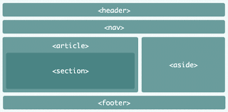

# My summary on reading Duckett’s HTML & CSS book:
.
This is chapter 17 which is titled (HTML5 layout) so this chapter talks about the long running style of designing HTML pages which is what you would normally see in blogging websites, and then the second page is talking about how almost it’s the same style but with improved new elements.
Such improvements and some of the new elements were made to organize your own code and they are the following:
1.	**Headers and footers**: Are new elements that helps you splitting your page into three sections to help you in designing for example you can put (logo’s, menus and name of the website in the header and give them a specific design). Main part contains other components such as (pictures, paragraphs and links). Footer part can contain other things such as (copy rights and cookies).
2.	**Navigation**: Contains major blocks and sections of the code you would like to include to keep your code organized and neat such as dropdown menus.
3.	**Article**: It’s an element that can be nested and its used to group related parts of the code.
4.	**Aside**: Is an element with two main purposes depending on where it is placed, inside the article element which in this case it should contain related but not necessarily important information’s to the article or outside of the article element which in here it acts as a container of information related to the whole page.
5.	**Sections**: It groups related information’s together and it has its own headings, therefore it is used to group parts not the whole page.
6.	**Heading groups**: It groups the six headings together as a single heading, people have been skeptical about it and still to this day so I guess you choose whatever suits you.
7.	**Figures**: This element is used to contain pictures, videos and diagrams and it contains contains a fig caption element as well.  
8.	**Div**: An element widely known and used to group a big chunk of related information’s and you can use it to groups the whole page.
9.	**Links**: For this we use the anchor tag which is represented by the letter “a”.
10.	## To help older browsers that does not support HTML5 you should include it within CSS as they would treat them this way.
.
Remember this is just a summary it’s short and straight to the point so if you are looking for deeper and more information, I would suggest you to read the book.