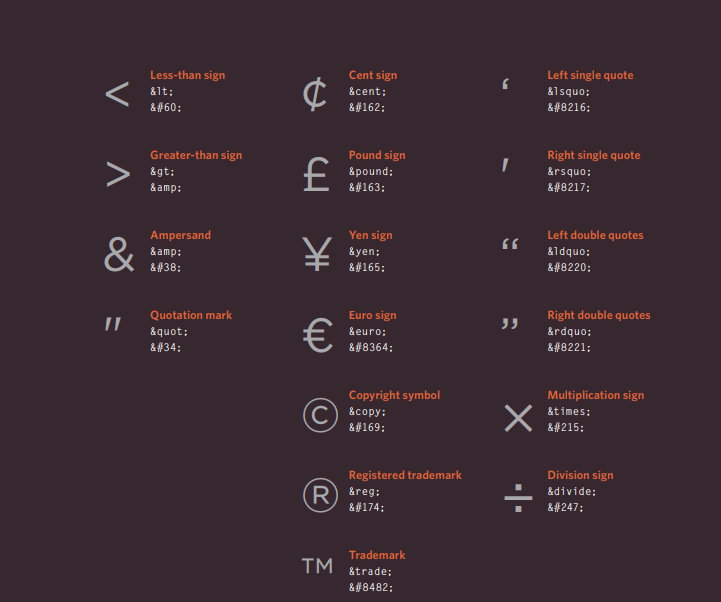

# My summary on reading Duckett’s HTML & CSS book:
What I have learned reading chapter 8 is that HTML had been developed so many times throughout the years and into many versions, therefore every new version was an improvement of the previous one so when you are using HTML you must make sure that your browser is compatible with the version you are using.
For example, **HTML4** was released in **1997** and there was a tag called “strike” that would cross the word but that tag is not used anymore in HTML5.
Later on, **XML** was released in **1998** it was a made to become the newest markup language and takeover HTML, but upon this release HTML4 was re formulated into **HTML5** which was released in **2000**.
## Some of the most important tags:
1.	**Doc type**: It is basically a declaration for the browser to know which version of HTML is being used.
2.	**Comments**: Where you be adding a comment that will not be visible to the users on the browser only in code for the developers.
3.	**ID attribute**: Its purpose is to identify the element when linking using figures.
4.	**Class attribute**: The class attribute is used to refer to a class in a style sheet. It can also be used by JavaScript.
5.	**Block elements**: It’s elements can be nested and contain a block of code in it such as <h1>, 
, <ul>, and <li>.
6.	**Inline elements**: Which you basically can use it within the same block and one even a single word such as <a>, <b>, <em>, and .
7.	**Span**: It is a generic inline container its contents and it doesn’t represent anything; it can be used to group elements for styling purposes.
8.	**Iframes**: It is used to embed another document in the current HTML page.
9.	**Meta**: Contains most important information’s about the HTML document and it’s placed in the head tag, it doesn’t have a closing tag it has its own attributes which specifies properties of the entire web page. These attributes are:
•	***Description***: Contains the description of the whole web page it helps search engines learn about the pages content and doesn’t exceed 155 characters. 
•	***Key words***: which can contain a specific word/s that would make it easier for the web page to appear on search engines.
•	***Robots***: It determines by specific methods whether a page should be added to search engines or not.
•	***Author***: Defines who is the author of the page.
•	***Pragma***: It prevents the browser from downloading the web page on its cache memory to save space.
•	***Expires***: Because web browser saves the contents on cache an expiry date is used to determine when its should be deleted from cache.
## Escape characters:
.