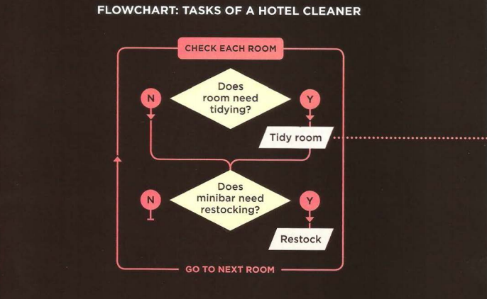
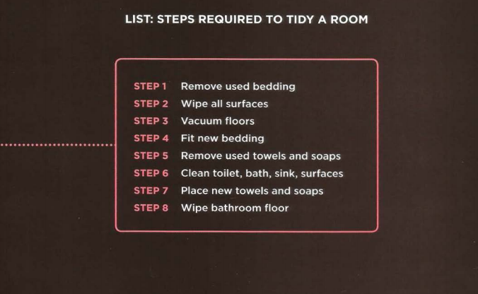

# A summary of Ducketts Java & jQuery book but only a few pages:
Intro:
## In general, this book is all about how to make your website more dynamic and usable beyond structuring and designs 
So, the book starts by implying the three main pre-requisite’s you need to start coding in JavaScript:
1.	Understanding basic syntax and rules of the language.
2.	Having a passion to learn the language itself.
3.	Familiarize yourself of the its application by practicing what you have learned.
## How does JavaScript make the website more interactive?  
1.	Simply by accessing and modifying its content where you can apply, add or even remove whatever parts you want.
2.	It set’s a group of steps for the browser to follow so it can keep up with changes happening and users’ interactions.
3.	 It reacts to events happening such as a button press, clicking on a link, redirecting users to another pages, etc.
## And one last tip is checking your browser’s version as some of the tags may not run because versions are not compatible with one another.
## What is a script & how do they work?
Script is a set of steps the browser must follow in order to perform a specific task and in the book the author referred to it as a “Food recipe” because them both are about the same concept, -a set of steps that you follow to create something-, it’s follows instructions step by step and the browser changes between and choosing different parts to follow depending on the orders of how users interact with it and a single script can sun many other subsets of scripts inside of it.
## How to write a script?
In order to write a script, you should try sketching up a plan that would help you out through the process. Start by defining your main goal then find out which other necessary tasks will help you achieving it.
1.	Defining goal: Ask yourself what are you trying to achieve? What’s the purpose of your script?
2.	Design the script: First split the big goal into smaller chunks and then start gathering information’s and know which tasks will help you.
3.	Write it using JavaScript.
An example from the book on sketching up your script plan:

## Expressions and operations:
For expressions we have two types of them:
*	Assignment value expressions: which gives the variable a value to function.
*	Return value expressions: Which takes two or more values to return a single one.
For operators:
*	Assignment operators: Which is as mentioned used to assign a value to the variable.
*	Arithmetic operators: Used for math related operations.
*	String operators: Used to manipulate strings.
*	Comparison operator: To compare two values and provide a result.
*	Logical operator: Performs logical non mathematical operations.
### Note: Expressions depend on operators to perform tasks.
A picture from the book on arithmetic operators:
 

## Functions are basically very helpful because instead of writing one big code that would have some repetitive lines and operations you can simply use functions to group specific related statements that together would perform a task.
Functions syntax:
Function name of function (Parameters) {all statements necessary to execute the task}.
Helpful? Well yes because every time you want to use it all you have to do is literally call its name.
### Note: This is just a summary for more details I’d suggest you either research or read the book.