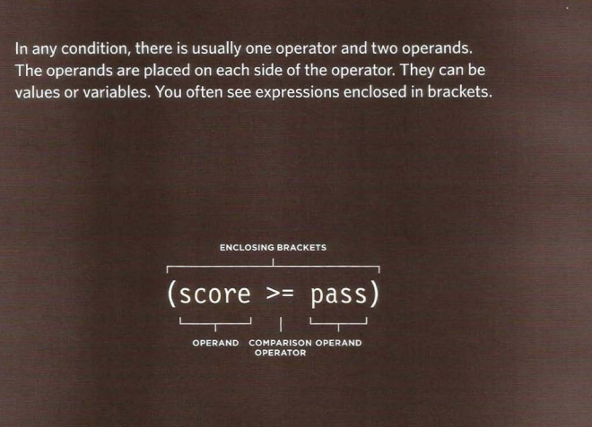
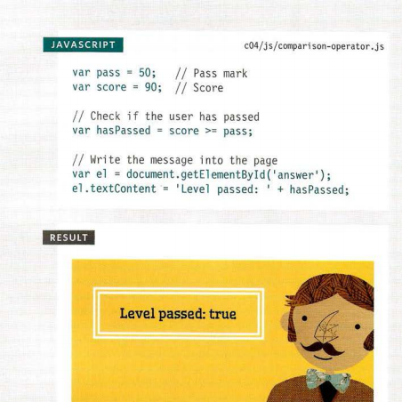
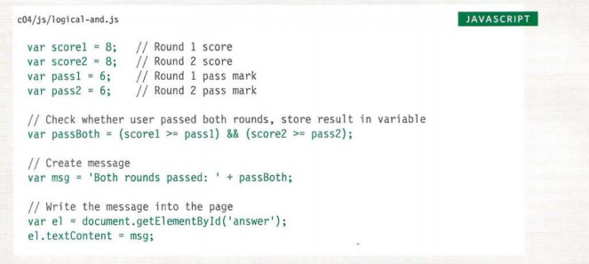
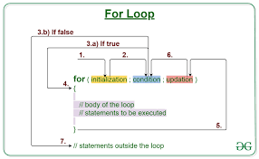
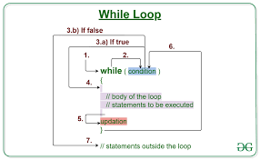
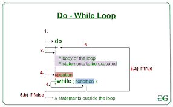

# Summary of a few page of Duckett’s book (JavaScript and jQuery):
In this section we are talking about the most important coding basics you’ll need not only in JS but in almost every programming language as they make the perfect logical sense when you are trying to translate from our human language to the computer language, starting here with:
*** Comparison operators ***:
These operators are used to compare two values and would return the results in the form of ‘True’ or ‘False’ and to evaluate specific segments of the code, and for other different reasons.
## These comparison operators are:
1.	*** Is Equals To ***: It compares two values to check if they are the same.
Syntax: (==).
2.	*** Is Not Equals To ***: It compares two values to check if they are not the same (to sometimes make exceptions).
Syntax: (!=).
3.	*** Strict Equal To ***: It doesn’t only make sure that the values are the same but also the data types.
Syntax: (===).
4.	*** Strict Not Equal To ***: It makes sure that both values and data types are not the same.
Syntax: (!==).
5.	*** Greater than ***: Compares two values and returns the greater value.
Syntax: (>).
6.	*** Less than ***: Compares two values and returns the less great value.
Syntax: (<).
7.	*** Greater than or equal to ***: Checks whether one value is greater than or equals to the other.
Syntax: (>=).
8.	*** Less than or equal to ***: Checks whether one value is less than or equals to the other.
Syntax: (<=).
**Its structure**:

**An Example**:

*** Logical operators***:
These operators allow you to compare two comparison operators like you can actually combine them in one sentence using logical operators.
And we have three logical operators:
1.	*** And operator ***: Tests more than one condition and depending on the combination of both results the final result is formatted.
Syntax: (&&). 
2.	*** Or operator ***: Tests at least one condition and determines the other then based on that the final result is formatted:
Syntax: (||).
3.	*** Not operator ***: Takes one value and gives the opposite of it as a final result.
Syntax: (!).

**An Example**:

*** Loops ***:
Contains a condition inside of them if the condition returns true all statements inside of it will run, it will recheck the code after each iteration and execute the statements until the condition returns false only then it will break out.
There are 3 types of loops:
1.***For loops ***: It is used to run the code a specific number of times and the condition inside of it is a numeric non symbolic counter, and it is often used with arrays.

2.*** While loop ***: In this loop your code will start running after checking the condition then it starts execution.

3.*** Do -While ***: In this loop the code will be executed at least once before checking the condition.

 
